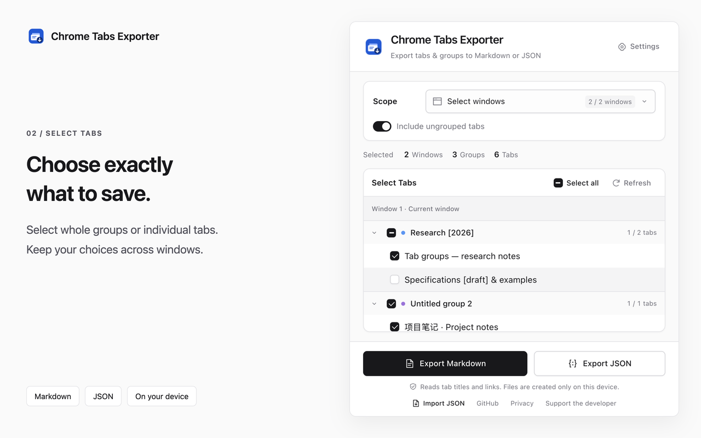

# Chrome Tabs Exporter

[简体中文](README.zh-CN.md) · [Privacy policy](PRIVACY.md) · [Repository](https://github.com/wurining/chrome-tabs-exporter)

A small Manifest V3 Chrome extension that exports open tabs and native tab groups to **Markdown or JSON**, and restores tabs from a compatible JSON file. File processing stays on your device.



## Features

- Choose one or more normal windows, whole groups or individual tabs, with an option to include ungrouped tabs.
- All tabs start selected. Group checkboxes show partial selections; counts reflect selected content.
- Window boundaries, group order, names, colors, collapsed states, and tab titles and full URLs.
- Choose Simplified Chinese, English or the browser language in Settings, plus system light and dark themes.
- No account, server, tracking, analytics, advertising, content scripts, or host permissions.
- Import a JSON file, preview its windows/groups/tabs, then restore into new windows or append to the current window.
- Restore group names, colors and collapsed states; retain duplicate URLs. Stop an ongoing restore while keeping already opened tabs.
- Incognito windows and the extension's own pages are excluded from exports.

## Install

The Chrome Web Store version is not published yet. You can install from source or a release ZIP.

1. Download the ZIP from a [GitHub release](https://github.com/wurining/chrome-tabs-exporter/releases), or clone this repository.
2. Extract the ZIP, or use the repository's `extension/` directory directly.
3. Open `chrome://extensions`, enable **Developer mode**, and choose **Load unpacked**.
4. Select the folder containing `manifest.json`. Pin the extension if you want quick access.

Requires Chrome 99 or later, for Promise-based runtime messaging. Testing uses isolated Chrome for Testing profiles; no personal browser profile is needed.

## Use

Open the extension and use Scope → Select windows to check one or more windows (the current window starts checked). In Select Tabs, use a group checkbox to select the whole group or check individual tabs. Groups show a mixed checkbox when only some tabs are selected. Switching windows, hiding ungrouped tabs and refreshing preserve choices for existing tabs during the same popup session. New tabs start selected; new windows start unchecked. Closing and reopening the popup resets tab choices. There is no fixed window or tab count cap; scrolling and keyboard navigation reach every tab while only visible rows are rendered.

Use Settings in the popup or Extension options in Chrome’s extension details to choose the interface and Markdown language. The preference is saved locally. Chrome’s own extension description and permission text continue to follow the browser language. Then export Markdown or JSON. The file chooser lets you select a destination. “Download started” means Chrome accepted the download; use Chrome's downloads list for the final save result.

Markdown uses links for HTTP/HTTPS URLs and plain code text for other schemes. JSON retains original URLs, including access parameters. Check an exported file before sharing private links.

### Import and restore

Click **Import JSON** at the bottom of the popup. Choose your file, review the preview and skipped URLs, then choose **Create new windows** (default, preserves file windows) or **Append to this window** (combines file windows in the import page's window). Click **Restore** to open the listed tabs. Existing tabs stay untouched and identical group names remain separate groups. No tabs open merely by choosing a file.

Restoration runs sequentially in the background; you can close the import page and reopen Import JSON to view progress or stop. Stopping keeps already opened tabs. Failed tab and group operations are reported separately. The restore button stays disabled after dispatch to prevent accidental replay; explicitly choose a file again to start another restore. Restarting Chrome or reloading the extension interrupts restoration. After an interruption or partial failure, check opened tabs before rerunning to avoid duplicates.

Restoration recreates URLs and group metadata. The JSON does not contain unsaved page edits, back/forward history, login sessions, pinned/active states, window geometry, or the exact interleaving of grouped and ungrouped tabs. Site titles come from the reopened pages. Browser navigation may normalize URL encoding while keeping query parameters. “Opened” counts tabs created by Chrome, not a guarantee that their websites loaded successfully. See the [minimal JSON format and supported URLs](docs/JSON_FORMAT.md).

## Permissions and privacy

| Permission | Use |
| --- | --- |
| `tabs` | Read open tab titles, URLs and positions for selection/export. Tab creation also uses the tabs API. |
| `tabGroups` | Read group metadata for export and restore names, colors and collapsed states on newly created groups. |
| `downloads` | Save the generated text file through Chrome's file chooser. |

File processing stays on your device. The extension stores no browsing archive or imported files. Only the interface language preference is saved persistently; selections, previews and restoration jobs use temporary memory. Opening or refreshing the selector reads titles, URLs and groups in normal windows; exports re-read selected windows. Restoring visits imported URLs through Chrome using your existing browser session, so those websites receive normal navigation requests. Read the [privacy policy](PRIVACY.md) for details.

## Development

Node.js 22+ and Python 3 are required for development and packaging. There are **no runtime dependencies** in the extension.

```sh
npm ci --ignore-scripts
npx playwright install chromium
npm run check
npm test
npm run test:browser
npm run assets
npm run locales
npm run docs
npm run package
```

`npm run verify` runs source checks, unit tests, browser tests and packaging. `npm run screenshots` renders fresh captures at 3x device pixel density using public demo tabs in a temporary browser profile. The public repository keeps one set of 1280×800 store screenshots per language in `docs/store-assets/en/` and `docs/store-assets/zh_CN/` (three each). The 2560×1600 review copies are saved only to `.local/screenshots/hd/`. Raw captures and its verification report also stay in the ignored `.local/` directory.

The deterministic ZIP is written to `dist/chrome-tabs-exporter-1.0.0.zip` with a SHA-256 checksum. Its root contains `manifest.json`; source docs, tests, dependencies and CI files are excluded. Browser tests also verify an installation extracted from that ZIP.

CI uploads the ZIP and checksum as a workflow artifact. Pushing a matching version tag such as `v1.0.0` also prepares a GitHub Release draft with those same verified files and changelog notes. Draft publication stays manual.

## JSON format

Version 1 exports `schemaVersion`, `exportedAt` (UTC), `scope` (`selected` for the checkbox UI; legacy readers also accept `current` or `all`), `includeUngrouped`, and `windows`. Each window contains `groups` and `ungroupedTabs`. A group entry contains `group: {title, color, collapsed}` and `tabs`. Each tab is `{title, url}`. Array order preserves group/tab ordering; the focused window comes first. Browser IDs, selected ID lists and unused Chrome metadata are omitted. Imports require only the window/tab structure and `url`; other fields are optional. Schema version 1 and omitted versions are accepted. See [JSON_FORMAT.md](docs/JSON_FORMAT.md) for minimal examples, defaults and validation. The prototype's raw Chrome-object JSON is not a supported public format.

## Support

All features are free. If this extension helps you, you can [Buy me a token on Buy Me a Coffee](https://buymeacoffee.com/chaiwang). The About page includes a local button and QR for the same public page. Support does not unlock features or affect reviews. No remote payment widget or font is loaded. WeChat and Alipay stay hidden until public payment codes are configured.

The repository contains user documentation, the JSON specification, privacy policy and selected public demo artwork. Account material, store submission drafts and operational notes are kept separately. GitHub Pages automatically deploys `docs/site/` after each push to `main`; the workflow also supports manual deployment from `main`.

Issues and contributions are welcome. Please remove private URLs and tokens from reports. Licensed under [MIT](LICENSE). This is an independent project and does not claim affiliation with Google.
