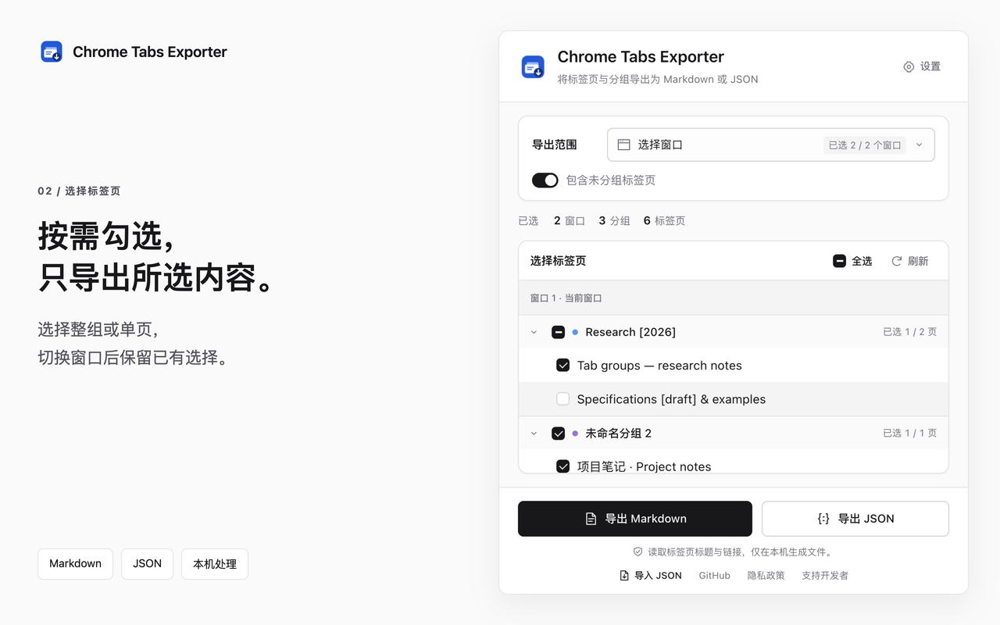

# Chrome Tabs Exporter

[English](README.md) · [隐私政策](PRIVACY.md) · [仓库](https://github.com/wurining/chrome-tabs-exporter)

一个使用 Manifest V3 的 Chrome 扩展，可以将打开的标签页和原生分组导出为 **Markdown 或 JSON**，也可以从兼容 JSON 文件恢复标签页。文件仅在本机处理。



## 功能

- 勾选一个或多个普通窗口、整组或单个标签页，可选择是否包含未分组标签页。
- 标签页默认全选；分组支持全选、取消及部分选中状态，数量反映实际选择。
- 保留窗口边界、分组顺序、组名、颜色、折叠状态，以及标签页标题和完整网址。
- 设置中可选择简体中文、英文或跟随浏览器语言；跟随系统明暗主题。
- 无需账号；不接入服务器、统计、追踪、广告、网页内容脚本或网站访问权限。
- 导入 JSON，先预览窗口、分组与标签页，再创建新窗口恢复，或追加到当前窗口。
- 恢复组名、颜色和折叠状态，保留重复网址；运行中可停止，保留已经打开的页面。
- 导出时排除隐身窗口和本扩展自身页面。

## 安装

Chrome 商店版本尚未发布，目前可以从源码或发布包安装。

1. 从 [GitHub 发布页](https://github.com/wurining/chrome-tabs-exporter/releases)下载 ZIP，或者克隆仓库。
2. 解压 ZIP，或者直接使用仓库中的 `extension/` 目录。
3. 打开 `chrome://extensions`，启用“开发者模式”，点击“加载已解压的扩展程序”。
4. 选择包含 `manifest.json` 的文件夹。需要快捷访问时，可以固定扩展图标。

要求 Chrome 99 或更新版本，以支持通过 Promise 返回结果的扩展消息接口。自动测试使用 Chrome for Testing 的独立临时配置，不使用你的个人浏览器资料。

## 使用与隐私

打开扩展，在“范围 → 选择窗口”中勾选一个或多个窗口，默认勾选当前窗口。在“选择标签页”中，勾选整组或单个标签页；整组只选了一部分时，分组框显示部分选中状态。在同一个弹窗内切换窗口、隐藏未分组标签页和刷新，会保留仍然存在的标签页选择；新标签页默认选中，新窗口默认不勾选。关闭并重新打开弹窗会重置标签页选择。列表没有固定数量上限，滚动和键盘可访问所有标签页，界面只绘制可见行，以减少大量标签页造成的卡顿。

通过弹窗“设置”或 Chrome 扩展详情中的“扩展选项”选择界面及 Markdown 语言；偏好保存在本机。Chrome 自己显示的扩展介绍及权限提示仍跟随浏览器语言。完成选择后导出 Markdown 或 JSON。保存对话框用于选择文件位置。“已发起下载”表示 Chrome 接受了请求，最终保存结果请在下载列表查看。

Markdown 将 HTTP／HTTPS 网址显示为链接，其他协议显示为代码文本。JSON 保留原始网址，包括访问参数。分享文件前，请检查其中的私人链接。

### 导入并恢复

点击弹窗底部“导入 JSON”，选择文件并检查预览及被跳过的网址。默认“创建新窗口”，按文件中的窗口结构恢复；“追加到当前窗口”会合并到导入页面所在的窗口。点击“恢复”后才批量打开页面，当前已打开的页面保持原样，同名分组也会各自创建。

任务按顺序在扩展后台运行，关闭导入页面后可以重新打开查看进度或停止。停止会保留已经打开的标签页；页面打开失败和分组异常分别显示。启动后恢复按钮保持禁用，重新选择文件才会开始另一次任务。重启 Chrome 或重新加载扩展会中断恢复；中断或部分失败后，重新运行前应先检查已打开的页面，避免重复。

恢复范围包括网址及分组信息。JSON 没有保存未提交的页面编辑、前进后退记录、登录会话(Login session)、固定／激活状态、窗口大小，以及分组与未分组标签页之间的精确位置。网页标题由重新打开的网站提供，Chrome 可能规范化网址编码，访问参数仍保留。“已打开”统计 Chrome 创建的标签页，不保证网站加载成功。完整的必选字段、默认值和支持的网址见 [JSON 格式说明](docs/JSON_FORMAT.md)。

| 权限(Permission) | 用途 |
| --- | --- |
| `tabs` | 读取标签页标题、网址和位置供选择及导出；恢复也使用标签页接口创建页面。 |
| `tabGroups` | 导出时读取组名、颜色和折叠状态；恢复时设置新分组的这些属性。 |
| `downloads` | 通过 Chrome 保存对话框保存生成文件。 |

文件仅在本机处理，扩展不保存浏览记录存档或导入文件，仅持久保存界面语言偏好；选择、预览和恢复任务暂存于内存。打开或刷新列表时读取普通窗口中的标题、网址和分组，导出时重新读取所选窗口。恢复会使用现有浏览器会话正常访问导入的网址，对应网站会收到访问请求。完整说明见[隐私政策](PRIVACY.md)。

## 开发与发布

开发需要 Node.js 22+ 和 Python 3。扩展本身没有运行时依赖(Runtime dependencies)。

```sh
npm ci --ignore-scripts
npx playwright install chromium
npm run verify
npm run assets
npm run locales
npm run docs
npm run screenshots
```

`npm run verify` 执行源码检查、单元测试(Unit tests)、浏览器测试(Browser tests)和打包。输出为 `dist/chrome-tabs-exporter-1.0.0.zip`，并附带 SHA-256 校验文件。安装包的根目录包含 `manifest.json`，不包含文档、测试和开发依赖。浏览器测试也会验证从该 ZIP 解压后的安装。

截图命令在临时浏览器中使用公开演示标签页，以三倍像素密度(Device pixel ratio)重新拍摄。公开仓库只在 `docs/store-assets/en/` 和 `docs/store-assets/zh_CN/` 各保留一套 1280×800 商店截图，每套三张。2560×1600 高清预览仅保存到 `.local/screenshots/hd/`，原始截图及验证报告也保存在 Git 忽略的 `.local/` 目录。

JSON 格式版本为 `schemaVersion: 1`，导出界面使用 `scope: "selected"`，只保留导出选项、时间、窗口与分组结构、组名／颜色／折叠状态，以及标签页标题与网址。数组次序表示分组和标签顺序，焦点窗口排在前面。原型中包含整个 Chrome 对象的 JSON 不作为公开格式维护。

全部功能免费，赞助自愿。你可以通过 [Buy Me a Coffee](https://buymeacoffee.com/chaiwang) 支持开发者；“关于与支持”页提供本地按钮和同一页面的二维码。赞助不解锁功能，也不与评分绑定；扩展不加载远程支付组件或字体。微信／支付宝在配置公开收款码前保持隐藏。

公开仓库保留使用说明、JSON 格式、隐私政策和经过检查的演示素材。发布者账号材料、商店申报草稿和内部操作记录单独保管；网站文档仅通过手动工作流(Workflow)部署。

欢迎通过 GitHub 反馈和贡献代码；请先去除私人网址及访问令牌。使用 [MIT 许可证](LICENSE)。本项目由独立开发者维护，不声称与 Google 存在隶属关系。
